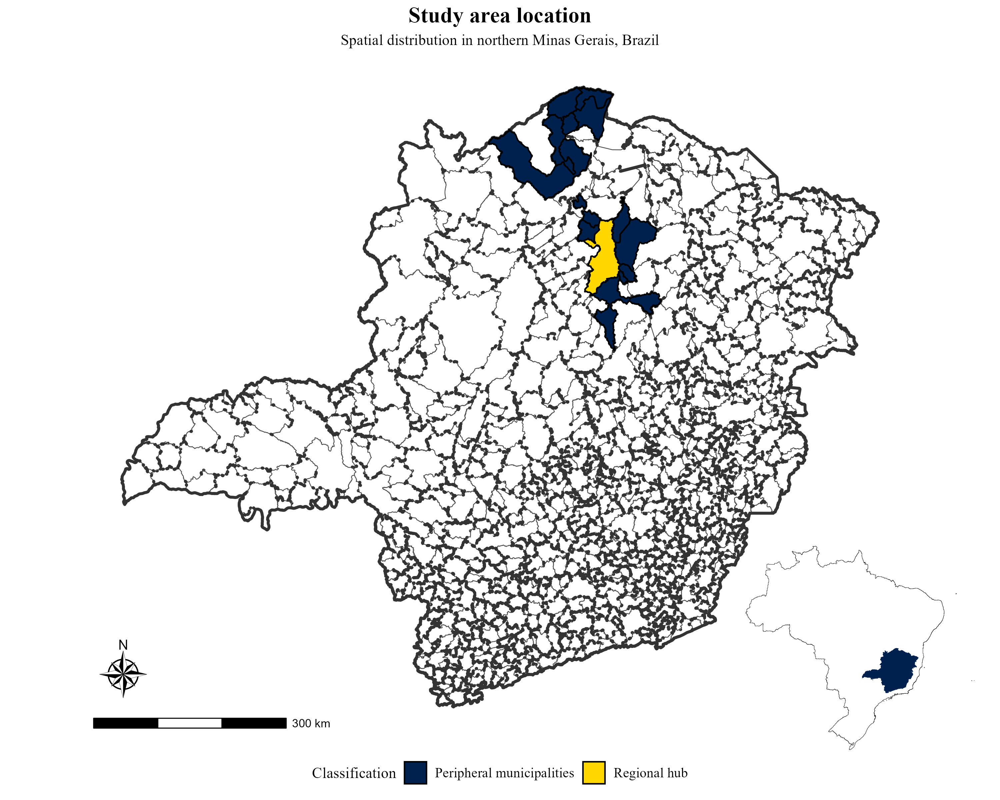
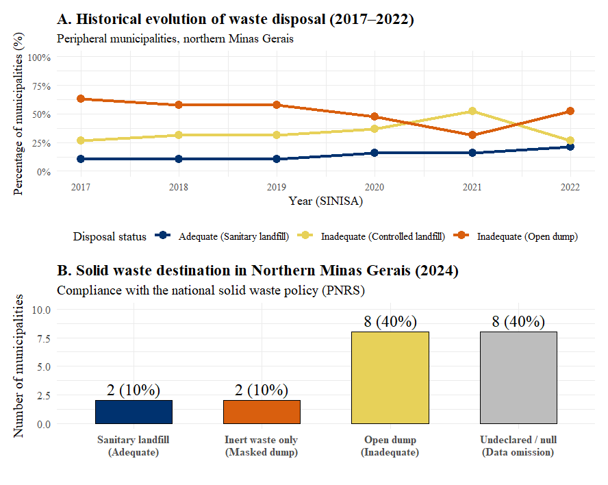

# Unequal sanitation in the Global South: infrastructure and governance shortfalls in northern Minas Gerais, Brazil

<a href="https://doi.org/10.1016/j.jup.2026.102343"></a>
<a href="#"></a>
<a href="https://www.sciencedirect.com/science/article/pii/S095717872600202X"></a>
<a href="https://creativecommons.org/licenses/by-nc/4.0/"></a>
<a href="https://www.r-project.org/"></a>

## Overview
This repository contains the replication data, microdata worksheets, and R scripts used for the analysis in the article **"Unequal sanitation in the Global South: infrastructure and governance shortfalls in northern Minas Gerais, Brazil"**, published in *Utilities Policy* (2027). 

## Highlights
* Evaluates centre-periphery sanitation disparities using SINISA 2024 microdata.
* Highlights 'statistical invisibility' in localities with lower institutional capacity.
* Shows that historical neglect of drainage exacerbates hydro-meteorological disasters.
* Demonstrates that capital investment alone cannot overcome operational inefficiencies.
* Concludes that privatisation policies fail without strict public interest regulation.

## Abstract
The universal provision of public utilities, such as basic sanitation, remains a critical challenge in the Global South, where infrastructure disparities and governance failures perpetuate the exclusion of vulnerable populations. This article analyses the disparities in the provision and management of water, sewerage, solid waste and drainage services in the Brazilian semi-arid region, comparing a regional hub (Montes Claros) with 19 peripheral municipalities in northern Minas Gerais. Using microdata from the National Sanitation Information System (SINISA – 2024), the study develops a matrix of institutional compliance and integrated indicators of coverage and inefficiency. The results confirm the persistence of a deep centre-periphery infrastructure divide and identify severe ‘statistical invisibility’ — characterised by an absence of official data — in localities with lower governance capacity. Furthermore, the study highlights the lack of coordination between sanitation policy areas, with a serious historical neglect of stormwater drainage and solid waste management. It is concluded that current funding metrics and the expansion of privatisation in the sector are insufficient without a regulatory framework that addresses territorial inequalities. 

**Keywords:** Basic sanitation; Regional inequality; Infrastructure governance

**Figure 1**
<p align="center">
  
</p>

**Figure 7**
<p align="center">
  
</p>

## Repository Structure

* `data/`: Contains the raw and processed microdata spreadsheets from the National Sanitation Information System (SINISA) for 2023, 2024, and historical time series.
* `scripts/`: Contains the R scripts used for data cleaning, statistical analysis, and data visualization. Numbered sequentially (`01_water.R`, `02_sewerage.R`, etc.) to indicate the order of execution.
* `figures/`: High-resolution outputs of the plots and maps generated by the R scripts and used in the manuscript.

## Reproducibility 
To reproduce the findings and figures from the article:
1. Clone this repository to your local machine.
2. Open the R project or set your working directory to the root of this folder.
3. Install the required R packages (listed at the top of the scripts).
4. Run the scripts in the `scripts/` directory in numerical order.

## Citation
If you use the data or scripts in this repository, please cite the original article:

```bibtex
@article{UtilitiesPolicy2027,
  title = {Unequal sanitation in the Global South: infrastructure and governance shortfalls in northern Minas Gerais, Brazil},
  journal = {Utilities Policy},
  year = {2027},
  issn = {0957-1787},
  doi = {[https://doi.org/10.1016/j.jup.2026.102343](https://doi.org/10.1016/j.jup.2026.102343)},
  url = {[https://www.sciencedirect.com/science/article/pii/S095717872600202X](https://www.sciencedirect.com/science/article/pii/S095717872600202X)}
}
